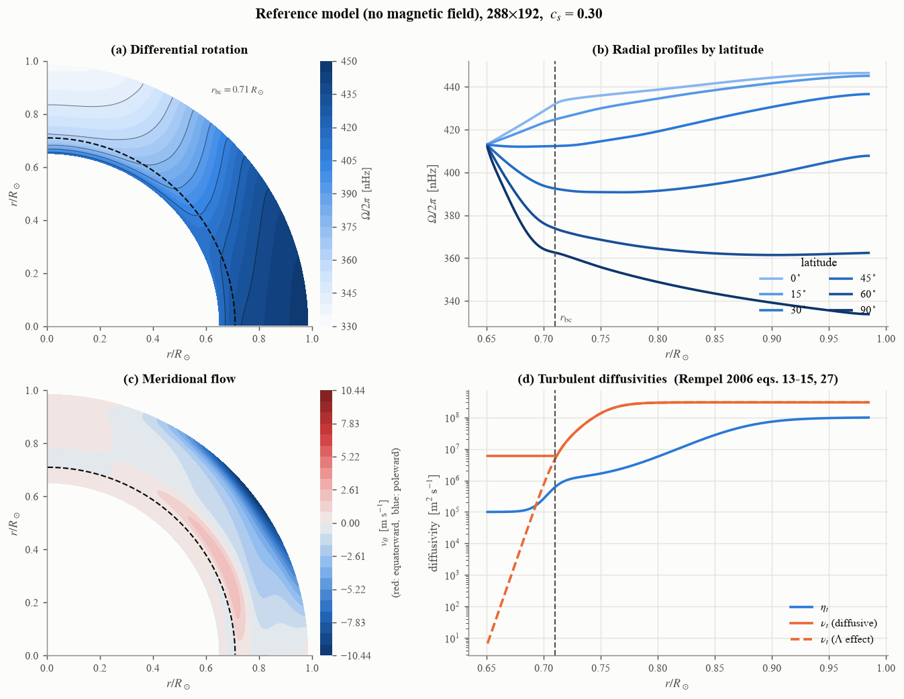
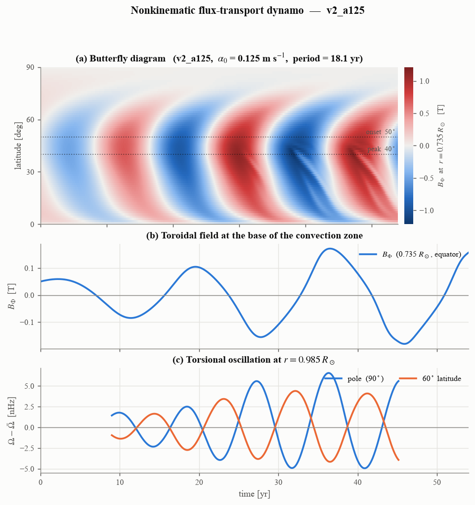
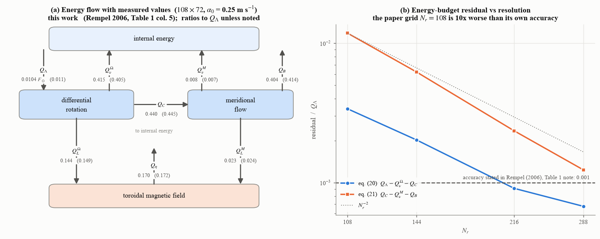
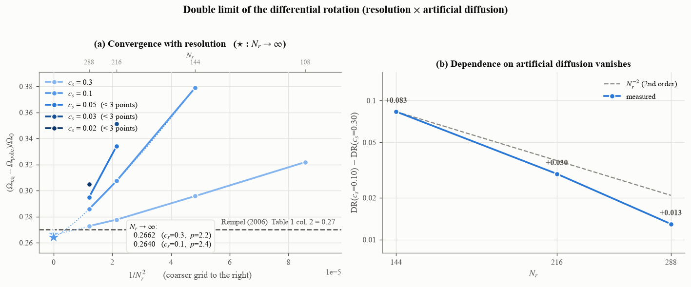
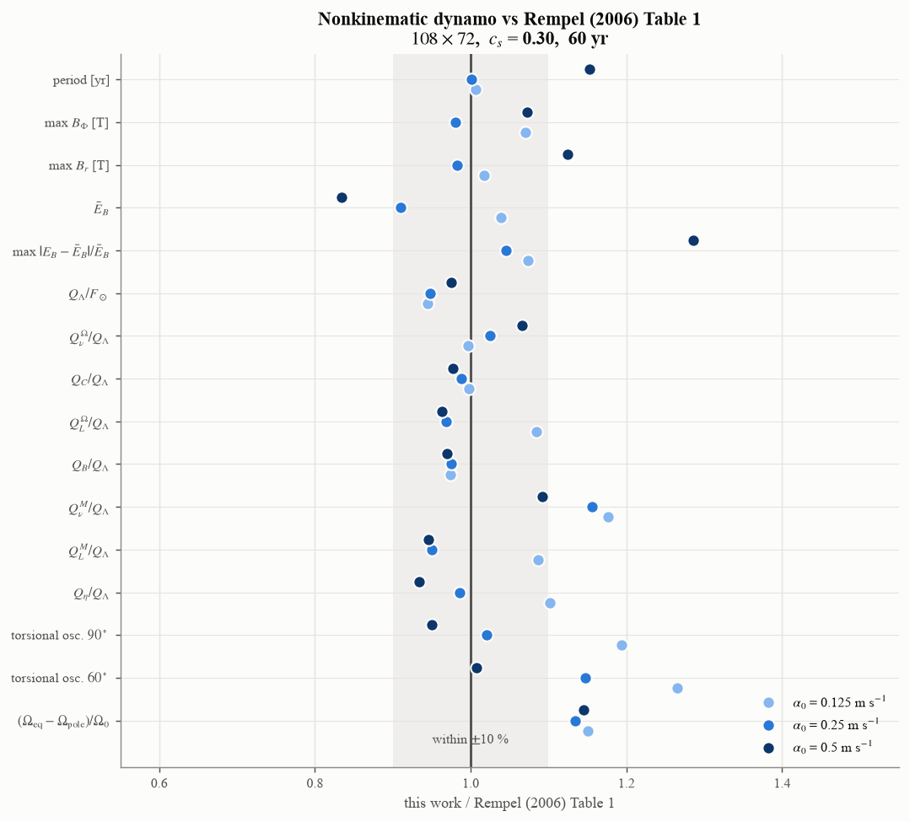

動力学モード (非運動学的ダイナモ)
=====================================

S2MFD には 2 つのモードがある。

**運動学的モード** (既定)
   差動回転と子午面流を**外から与え**\ 、誘導方程式だけを解く。
   Jouve et al. (2008) 準拠。:doc:`usage` を参照。

**動力学モード** (``cfg.dynamics = 'full'``)
   運動量・角運動量・連続の式・エントロピーの式も解き、**磁場が
   差動回転と子午面流に反作用する**\ 。Rempel (2005, 2006) のモデル。
   この章はこちらを説明する。

.. contents:: この章の内容
   :local:
   :depth: 2

何を解いているか
----------------

軸対称 (:math:`\partial/\partial\phi = 0`) の平均場 MHD を、音速を人為的に
下げた圧縮性の形で解く。従属変数は

.. math::
   \rho_1,\; v_r,\; v_\theta,\; \Omega_1,\; s_1,\; B_\Phi,\; A_\Phi

で、:math:`\rho_1` と :math:`s_1` は球対称な背景 (:math:`\rho_0`,
:math:`p_0`, :math:`T_0`) からのずれ、:math:`\Omega_1` は剛体回転
:math:`\Omega_0` からのずれ、:math:`A_\Phi` はポロイダル磁場のベクトル
ポテンシャル (:math:`\nabla\cdot\boldsymbol{B}=0` を保証する)。

方程式は Rempel (2006) の式 (1)-(7)。差動回転を駆動するのは
**:math:`\Lambda` 効果** (非拡散的なレイノルズ応力) で、子午面流はコリオリ力
との不均衡から**自発的に生じる**\ 。磁場は Babcock-Leighton 型の
:math:`\alpha` 効果で維持する。

.. list-table:: 主な要素
   :header-rows: 1
   :widths: 24 76

   * - 要素
     - 実装
   * - :math:`\Lambda` 効果
     - Rempel (2005) 式 (31)-(33)。:mod:`S2MFD.setup` の ``build_lambda``
   * - 乱流粘性・熱伝導
     - 式 (27)-(30)。放射層では拡散項の粘性を対流層の 2 %、熱伝導を 0.2 %
       に落とす (:math:`\Lambda` 効果に使う粘性には落とさない)
   * - 磁気拡散
     - Rempel (2006) 式 (13)-(15)。3 段の tanh プロファイル
   * - :math:`\alpha` 効果
     - 式 (16)-(19)。対流層底 [0.71, 0.76] :math:`R_\odot` の
       :math:`B_\Phi` を放物線カーネルで平均し、表面近くに源を置く
   * - 音速抑制 (RSST)
     - 連続の式に :math:`1/\zeta^2` を掛ける (:math:`\zeta = 100`)。
       Rempel (2005) 式 (35)
   * - 人工拡散
     - Rempel (2014) の slope-limited diffusion (SLD)。**論文にはない**
       ので、その強さ ``sld_cs_factor`` は数値パラメタとして扱う
   * - 時間積分
     - SSP-RK2 + 中心差分。CFL 安全率は von Neumann 解析の中立点から自動決定

参照モデル (磁場なし)
---------------------

まず磁場なしで流体を緩和させ、:math:`\Lambda` 効果が作る差動回転と
子午面流を得る。これが Rempel (2006) の「参照モデル」で、表 1 の列 2 に
対応する。

   緩和した参照モデル (288 :math:`\times` 192, ``sld_cs_factor`` = 0.30)。
   (a) 差動回転。赤道が速く極が遅い。(b) 緯度ごとの動径分布 — 原論文
   図 1b に対応する。:math:`r = 0.65\,R_\odot` で剛体回転を課しているので
   全緯度が 413 nHz に収束する。(c) 子午面流。表面で極向き、対流層底で
   赤道向きの 1 セル。(d) 拡散係数。:math:`\eta_t` は対流層内で 3 桁変わる。
   :math:`\Lambda` 効果に使う粘性 (破線) だけ放射層で下限を張らない。

走らせ方::

    python run_paris/relax_scan.py 108 72 40 uniform_rotation myrun \
        sld_cs_factor=0.30

引数は ``解像度_r 解像度_theta 年数 下部境界 タグ``。``名前=値`` で
``cfg`` を上書きできる。``S2MFD_PARFILE`` でパラメタファイルを選ぶ
(論文設定は ``parameters/rempel06_paper.py``)。

ダイナモ
--------

緩和した状態に種磁場を入れ、ローレンツ力のフィードバックまで含めて回す。

   :math:`\alpha_0 = 0.125` m s\ :sup:`-1` の解 (108 :math:`\times` 72、
   60 年)。(a) 対流層底のトロイダル磁場の蝶形図。**赤道向きに移動する**
   活動帯が出る (子午面流による磁束輸送)。(b) 赤道・0.735
   :math:`R_\odot` の :math:`B_\Phi`。周期 18.1 年 (論文 18 年)。
   (c) 表面のトーショナル振動。極と緯度 60 度で位相が異なる。

走らせ方::

    python run_paris/dynamo7.py 108 72 0 60 mydynamo full \
        alpha0=12.5 magnetic_buoyancy=1 sld_cs_factor=0.30 \
        init=results_rempel/myrun/state.npz

``full`` を ``kinematic`` にするとローレンツ力を切る (論文 図 3 の参照解)。
``alpha0`` は cm/s。

エネルギー収支
--------------

Rempel (2006) 式 (20)-(22) の収支をそのまま追える
(:class:`S2MFD.physics.energy.EnergyBudget`)。**これはコードが正しく
動いているかの最も強い検査**\ でもある。

   (a) エネルギーの流れ (原論文 図 7) に**実測値**\ を書き込んだもの。
   括弧内は Rempel (2006) 表 1 列 5。8 項すべてが数パーセント以内で一致
   する。(b) 収支式の残差。**原論文が表 1 の注で明記している精度
   0.001 を、論文の格子 (** :math:`N_r=108` **) では 10 倍上回る。**
   解像度とともに 2 次で消える。

.. warning::
   **左辺の** :math:`dE/dt` **を落とさないこと。** 定常だと思い込んで
   ゼロと置くと、成長中のダイナモでは残差が入力の 10-25 % に見える。

   :math:`E_\Omega` の時間微分は **差動回転のエネルギー**
   (:math:`\Omega_1` だけ) で評価する。:math:`\Omega_0` の項は全角運動量
   保存から解析的に厳密ゼロだが、離散では消えず、本物の信号の 40 倍
   残る。詳細は :meth:`S2MFD.physics.energy.EnergyBudget.budget_residuals`。

確認は::

    python run_paris/budget_check.py mydynamo          # ダイナモ
    python run_paris/budget_check.py --relax myrun     # 磁場なし

収束性
------

**この実装の付加価値は、論文の数値が未収束であることを定量化した点にある。**

解像度と人工拡散の 2 つの極限を独立に取る必要がある。片方だけ振っても
収束先は分からない (人工拡散を弱めると DR は増え、解像度を上げると減る)。

   (a) 差動回転の解像度依存。:math:`c_s` (人工拡散の強さ) を固定して
   :math:`N_r\to\infty` に外挿すると、:math:`c_s = 0.30` と 0.10 が
   **独立に同じ値 (0.264-0.266) に来る**\ 。論文値は 0.27。
   (b) 固定解像度での人工拡散への依存の幅。解像度とともに 2 次で消える。
   つまり**二重極限は交換する**\ 。

.. note::
   **飽和判定に注意する。** 人工拡散が弱く格子が粗いランは緩和の時定数が
   数百年になり、100 年走らせても飽和しない。傾きの閾値だけで判定すると
   未飽和のランを通してしまう。``run_paris/convergence.py`` は緩和曲線
   :math:`DR(t) = DR_\infty - A e^{-t/\tau}` を当てはめて「残りどれだけ
   動くか」を出す。

確認は::

    python run_paris/convergence.py --extrap

原論文との比較
--------------

   Rempel (2006) 表 1 との比 (108 :math:`\times` 72、60 年)。灰色の帯が
   :math:`\pm 10` %。磁場の量とエネルギー交換項はほぼすべて帯の中に入る。

   外れているのは **差動回転**\ で 1.12-1.15 倍。これは参照モデルが
   108 :math:`\times` 72 で 1.19 倍過大なことの持ち込みで、自分の
   運動学的参照解で規格化すると 0.96-0.99 になる。

.. note::
   **2026-08-25 訂正。** ここには「トーショナル振動が
   :math:`\alpha_0` の大きいほど過小 (0.67-0.70)」と書いてあったが、
   これは**振幅の測り方の誤り**\ だった。幅 18 年の移動平均で永年
   ドリフトを引き、両端を捨てていたが、解析区間も 20 年なので**残るのが
   2 年ぶんだけ**になり、「末尾 20 年の最大」が「どこか 2 年間の最大」に
   なっていた。区間内の 1 次トレンドを引く測り方に直すと

   .. list-table::
      :header-rows: 1
      :widths: 20 20 20 20 20

      * - :math:`\alpha_0` [cm/s]
        - 90° 計算/論文
        - 60° 計算/論文
        - (旧の値 90°)
        - 格子
      * - 12.5
        - 5.6 / 4.7 = 1.19
        - 4.4 / 3.5 = 1.26
        - 1.14
        - 108×72
      * - 12.5
        - 5.2 / 4.7 = 1.10
        - 3.7 / 3.5 = 1.07
        - —
        - 144×96
      * - 25.0
        - 11.7 / 11.5 = **1.02**
        - 7.9 / 6.9 = 1.15
        - 0.69
        - 108×72
      * - 50.0
        - 16.8 / 17.7 = **0.95**
        - 8.4 / 8.3 = 1.01
        - 0.70
        - 108×72

   となり、**すべて 1 割前後で合う**\ 。詳細は
   ``doc/dev_records/2026-08-24_torsional_pole.md``\ 。
   なお 20 年の区間に周期 18 年は 1.1 サイクルしか入らないので、
   1 次の当てはめが振動を一部吸って振幅を 1 割ほど過大に返す。
   **論文値との比を 1 割の精度で議論してはいけない。**

確認は::

    python run_paris/table1.py mydynamo:12.5

論文からの意図的な逸脱
----------------------

.. list-table::
   :header-rows: 1
   :widths: 26 74

   * - 項目
     - 内容と理由
   * - 磁場の下部境界
     - 論文は :math:`B_\Phi = 0` (反対称)。本実装の既定は
       :math:`d(rB_\Phi)/dr = 0` (**対称 = 閉じた境界**)。
       :math:`r=0.65\,R_\odot` は放射層の内部で、良導体なら磁場は
       蓄えられるべきである。論文自身が §3.2 で「:math:`B_\Phi` だけは
       closed boundary condition ではない」と認めている。
       論文どおりにしたい場合は
       **どちらでも 2.5 サイクルではダイナモが 0.06 % しか変わらない**\ (下記)。
       ``boundary_condition_type='R06', magnetic_open_boundary=1``
   * - 数値スキーム
     - 論文は MacCormack (交互風上/風下)、本実装は SSP-RK2 + 中心差分
       + SLD 人工拡散。**論文には人工拡散の項がない**\ ので
       ``sld_cs_factor`` に対応物はない。これが「同じ 108 :math:`\times` 72
       でも DR が違う」主因
   * - :math:`R_\odot`
     - 論文は :math:`7\times10^8` m、本実装は真の値
       :math:`6.96\times10^8` m。:math:`Q_\Lambda` への影響は 0.7 %

下部境界の対照実験 (108 :math:`\times` 72 の運動学的ダイナモ、45 年
= 2.5 サイクル、物理は同一):

.. list-table::
   :header-rows: 1
   :widths: 16 42 42

   * - :math:`t` [yr]
     - 0.735 :math:`R_\odot` 赤道の相対差
     - 放射層 (:math:`r<0.71\,R_\odot`) の磁束の相対差
   * - 5
     - :math:`8.7\times10^{-13}`
     - 3 %
   * - 15
     - :math:`1.4\times10^{-6}`
     - 17 %
   * - 30
     - :math:`3.3\times10^{-4}`
     - 101 % (符号反転の時期)
   * - 45
     - :math:`6.4\times10^{-4}`
     - 32 %

**境界の影響は放射層に閉じ込められていて、対流層のダイナモには届かない**\ 。
:math:`\max|B_\Phi|` は 1.4169 対 1.4168 T、:math:`\max|B_r|` は 5 桁一致。

.. note::
   放射層の磁気拡散時間は :math:`L^2/\eta_c` = **516 年 = 周期の 29 倍**\ 。
   45 年ではその 1/10 も見ていないので、**数十サイクル後の蓄積の差は
   判定できていない**\ 。見るには数百年の積分が要る。

未解決として、収束解の :math:`Q_\Lambda` が論文より 11 % 低い。
:math:`\Lambda` 効果の式・規格化・パラメタは一項目ずつ照合して
すべて一致している。

参考文献
--------

* Rempel, M. 2005, ApJ, 622, 1320 — 差動回転と子午面流のモデル
* Rempel, M. 2006, ApJ, 647, 662 — ローレンツ力を含む磁束輸送ダイナモ
* Rempel, M. 2014, ApJ, 789, 132 — slope-limited diffusion
