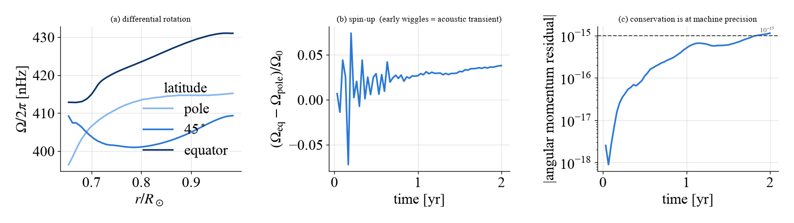

Rempel (2006) を再現する
==========================

原論文の表 1・図 3・図 4 を再現する手順。**計算量が要る**\ ので、まず
5 分で動く例で仕組みを確かめてから本番に進むことを勧める。

.. contents:: 手順
   :local:

0. 5 分で動かしてみる
---------------------

::

    python examples/rempel2006/quickstart.py out/

48 :math:`\times` 32 の粗い格子で参照モデルを 2 年緩和させ、

1. :math:`\Lambda` 効果が差動回転を作りはじめること
2. **角運動量が machine precision (:math:`10^{-15}`) で保存すること**
3. エネルギー収支の各項

を表示して図を保存する。**実測 5 分** (最初の 1 回は numba の JIT を含む)。

   ``quickstart.py`` が出す図。(a) 2 年ではまだ差動回転が育っていない。
   (b) 最初の振動は音波の過渡。(c) **角運動量の残差が**
   :math:`10^{-15}` **以下**\ 、つまり倍精度の丸め誤差の水準にある。

.. important::
   この格子と年数では**論文値と合わないのが正しい**\ 。緩和は 108
   :math:`\times` 72 でも 40 年かかる。合わないことを確かめるのが目的。

.. note::
   ``run_paris/`` と ``examples/`` の各スクリプトは**リポジトリに入って
   いるもので、pip でインストールされるパッケージには含まれない**\ 。
   使うにはリポジトリを clone すること。パッケージ本体
   (``import S2MFD``) だけでも同じことはできる —
   スクリプトはその使い方の例でもある。

1. 参照モデルを緩和させる
-------------------------

磁場なしで流体を回し、:math:`\Lambda` 効果が作る差動回転と子午面流を得る。

::

    export S2MFD_PARFILE=parameters/rempel06_paper.py
    python run_paris/relax_scan.py 108 72 40 uniform_rotation ref108 \
        sld_cs_factor=0.30

引数は ``N_r N_theta 年数 下部境界 タグ``。結果は
``results_rempel/ref108/`` に出る (``state.npz`` = 最終状態、
``history.npz`` = 時系列)。

.. list-table:: 目安の計算量 (1 コアあたり ms/step、paris = AMD EPYC 9354)
   :header-rows: 1
   :widths: 18 14 14 18 18

   * - 格子
     - :math:`\Delta t`
     - ms/step
     - 40 年
     - 推奨スレッド
   * - 108 :math:`\times` 72
     - 167 s
     - 4.0
     - 8 時間
     - 3
   * - 144 :math:`\times` 96
     - 133 s
     - 4.4
     - 12 時間
     - 4-5
   * - 216 :math:`\times` 144
     - 84 s
     - 7.8
     - 33 時間
     - 8
   * - 288 :math:`\times` 192
     - 63 s
     - 8.7
     - 49 時間
     - 12-16

並列度は ``S2MFD_PARALLEL`` で決める (``OMP_NUM_THREADS`` ではない)。
格子が小さいと 2-3 スレッドで頭打ちになる。

**飽和したかは傾きで確かめる。** ``python run_paris/convergence.py`` が
:math:`dDR/dt` と緩和曲線の外挿を出す。人工拡散が弱いと緩和の時定数が
数百年になり、100 年走らせても飽和しないことがある。

2. 磁場を入れてダイナモを回す
-----------------------------

::

    python run_paris/dynamo7.py 108 72 0 60 dyn_a125 full \
        alpha0=12.5 magnetic_buoyancy=1 sld_cs_factor=0.30 \
        init=results_rempel/ref108/state.npz

``0`` は「追加の緩和年数」(``init`` から始めるので 0)、``60`` がダイナモの
年数。**周期が 18 年なので、周期を測るには 2 サイクル (40 年) 以上要る。**
108 :math:`\times` 72 で 60 年が約 10 時間。

論文の 3 ケースは ``alpha0`` = 12.5 / 25.0 / 50.0 [cm/s]
(= 0.125 / 0.25 / 0.5 m/s)。``full`` を ``kinematic`` にすると
ローレンツ力を切った参照解 (図 3) になる。

3. 表 1 と突き合わせる
----------------------

::

    python run_paris/table1.py dyn_a125:12.5

``タグ:alpha0`` の形で複数指定できる。周期・磁場の最大値・
トーショナル振動・エネルギー交換項を論文値と並べて比を出す。

.. figure:: _static/figures/table1_comparison.png
   :width: 78%

   60 年完走した 3 ケースの結果。灰色の帯が :math:`\pm10` %。

.. note::
   **振幅を測るときはドリフトを引く。** まだ成長している解では、
   永年変化が「サイクル変動」に乗る。``table1.py`` は 18 年幅の移動平均を
   引いた値と生値の両方を出す (実測で 0.108 対 0.51 と 5 倍違った)。

4. エネルギー収支を確かめる
---------------------------

::

    python run_paris/budget_check.py dyn_a125
    python run_paris/budget_check.py --relax ref108

原論文は表 1 の注で「エネルギー交換項の精度は 0.001 程度」と明記して
いる。同じ基準で見られる。

.. warning::
   残差を読むときは**左辺の** :math:`dE/dt` **を落とさないこと**\ 。
   成長中のダイナモでは左辺が入力の 10-25 % ある。

5. 収束性を調べる
-----------------

**ここがこの実装の付加価値。** 解像度と人工拡散の 2 つを独立に振る。

::

    for cs in 0.30 0.10 0.05; do
      for n in 108 144 216 288; do
        python run_paris/relax_scan.py $n $((n*2/3)) 40 uniform_rotation \
            s${n}_cs${cs} sld_cs_factor=$cs
      done
    done
    python run_paris/convergence.py --extrap

.. figure:: _static/figures/convergence_dr.png
   :width: 100%

粗い格子の状態を種にすると過渡を飛ばせる (``init=`` と
``run_paris/regrid.py``)。全部そろえると数百 CPU 時間になるので、
まず :math:`c_s = 0.30` の系列だけで 108 → 288 を通すとよい。

よくある落とし穴
----------------

.. list-table::
   :header-rows: 1
   :widths: 32 68

   * - 症状
     - 原因
   * - 発散する
     - 人工拡散が弱すぎる。粗い格子ほど下限が高い
       (72 :math:`\times` 48 では :math:`c_s\gtrsim0.10`、
       108 :math:`\times` 72 では 0.03)
   * - 収支の残差が大きい
     - 左辺の :math:`dE/dt` を落としている。または :math:`E_\Omega` を
       :math:`\Omega_0` 込みで評価している
   * - 振動の振幅が論文の数倍
     - 永年ドリフトを引いていない
   * - 診断の値が桁違い
     - ゴーストセル込みで ``max()`` を取っている。物理セルは
       ``[margin, ixg-margin)``
   * - 収束表が古い値を出す
     - 同じ (格子, cs) で複数のランがある。``convergence.py`` は
       最も長いものを採る
